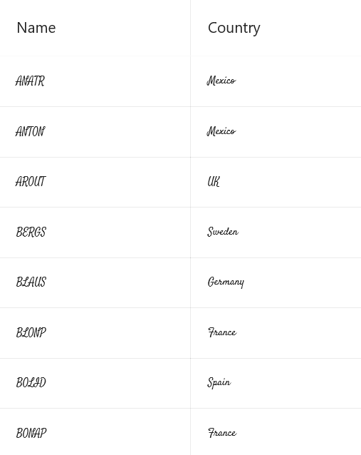

# how-to-display-custom-font-in-grid-cell-in-maui-datagrid

The .NET [MAUI DataGrid](https://www.syncfusion.com/maui-controls/maui-datagrid)(SfDataGrid) allows you to display custom fonts in DataGridColumn. To use the custom fonts in SfDataGrid, refer to the following steps:

Step 1: Add the custom fonts in True Type Font (TTF) format in the Resources’ Fonts folder.

Step 2: Register the fonts by invoking the ConfigureFonts method on the MauiAppBuilder object. Add the required fonts using the AddFont method by passing the font filename as a parameter. You can also specify an optional alias name by passing the second parameter.

```C#
public static class MauiProgram
{
	public static MauiApp CreateMauiApp()
	{
		var builder = MauiApp.CreateBuilder();
		builder
			.UseMauiApp<App>()
			.ConfigureFonts(fonts =>
			{
                fonts.AddFont("Lobster-Regular.ttf", "LobsterRegular");
                fonts.AddFont("Satisfy-Regular.ttf", "SatisfyRegular");
            });
        builder.ConfigureSyncfusionCore();
        return builder.Build();
	}
}
```
Step 3: Consume the fonts by referencing its name or alias name to the [RowFontFamily](https://help.syncfusion.com/cr/maui/Syncfusion.Maui.DataGrid.DataGridStyle.html#Syncfusion_Maui_DataGrid_DataGridStyle_RowFontFamily) property of [DataGridStyle](https://help.syncfusion.com/cr/maui/Syncfusion.Maui.DataGrid.DataGridStyle.html).

``` XML
<syncfusion:SfDataGrid x:Name="dataGrid" AutoGenerateColumnsMode="None" GridLinesVisibility="Both" HeaderGridLinesVisibility="Both" ColumnWidthMode="Fill" ItemsSource="{Binding OrderInfoCollection}"  >
        <syncfusion:SfDataGrid.DefaultStyle>
            <syncfusion:DataGridStyle  RowFontSize="10" RowFontFamily="Satisfy-Regular"></syncfusion:DataGridStyle>
        </syncfusion:SfDataGrid.DefaultStyle>
        <syncfusion:SfDataGrid.Columns>
            <syncfusion:DataGridTextColumn MappingName="Customer" HeaderText="Name">
            </syncfusion:DataGridTextColumn>
            <syncfusion:DataGridTextColumn MappingName="Country"></syncfusion:DataGridTextColumn>
        </syncfusion:SfDataGrid.Columns>
    </syncfusion:SfDataGrid>
```


